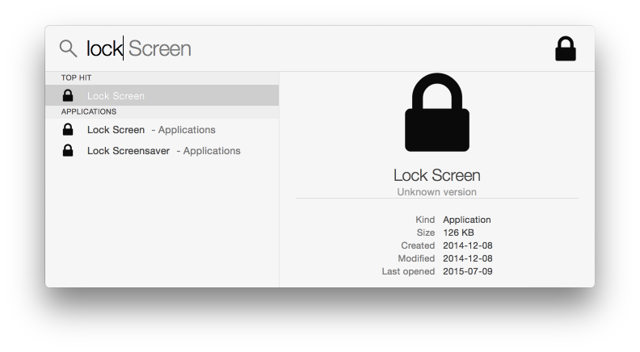
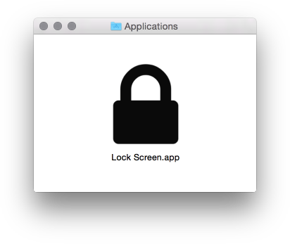

# Lock Screen

The missing Lock Screen app for Spotlight, for OS X.

## Introduction

Both LaunchBar and Alfred have lock screen commands built-in for convenience, Spotlight's turn:

Or just locking screen up directly from Finder:

## Installation

> To make use of any of this code, download / pull this repository and run the `build`
> command line script. Make sure you pick the right app-bundle to use for your OSX version
> and situation.

This folder contains three different ways of locking your screen. Two of which are based
on the 'Lock Screen' functionality of the Keychain.app, the third based off of the
screensaver password requirement. I've searched and fine-tuned these solution because of
my own specific requirements in combination with OSX limitations.

1. Screensaver should be able to come up without requiring a password. Staring at the wall
    figuring out an issue shouldn't slow me down when I get back to implementing my
    solution.
2. Must be able to create some form of shortcut-key to lock the screen. Mouse interaction
    is too slow and cumbersome if I quickly want to leave my desk.
3. Universal Access is blocked by `Bartender.app`. This breaks running through the menu
    using assistive device access :(
4. Mavericks introduces a different way of opening / closing the screensaver, can not
    depend on script to run remaining commands after the screensaver closes. This breaks
    my preference toggling solution.

Due to changes to OSX, not all versions may be viable on every system, I've listed them in
order of ease of use:

- **10.9+** `Lock Screen Bundle.app`, this application makes use of the Keychain.app via a
  custom Objective-C script. It might work on older versions of OSX, should not be harmful
  to try but make sure you save all your open documents before you try...
- **10.7-** `Lock Screensaver.app`, this application uses `defaults write` to temporarily
  require password on wake, then starts up the screensaver and afterwards sets the require
  password option back to false. **WARNING:** This script should not be used on 10.9! You
  might be able to use it in 10.8 (I skipped 10.8), test at your own risk, might require
  a reboot to get back into OSX. Won't harm your machine, but make sure you have no
  unsaved documents open :)
- **10.n** `Lock Screen.app`, this script makes use of the '*access for assistive
  devices*' to open up the menu bar items and search the menu's for a menu item labeled
  '*Lock Screen*' and works on any version of OSX. When found the script activates this
  menu-item, causing your screen to get locked. In order to allow it to do it's thing,
  you'll need to do the following:
  + '*System Preferences*'/'*Universal Access*' check the '*Enable access for assistive
    devices*' checkbox.
  + '*Keychain Access*'/'*Preferences*' check the '*Show keychain status in menu bar*'
    checkbox.

This folder contains an exception to the plain-text-only nature of provided code. Since I
will not assume everybody has `clang` installed I've included the build binary of `main.m`
in the repository. The build-script has the required build-instruction commented out.

Acknowledgments
---------------

[gaomd/lock-screen-app](https://github.com/gaomd/lock-screen-app) was forked from [windgazer's WALS repository](https://github.com/windgazer/WALS), only kept lock screen parts with improvements.
